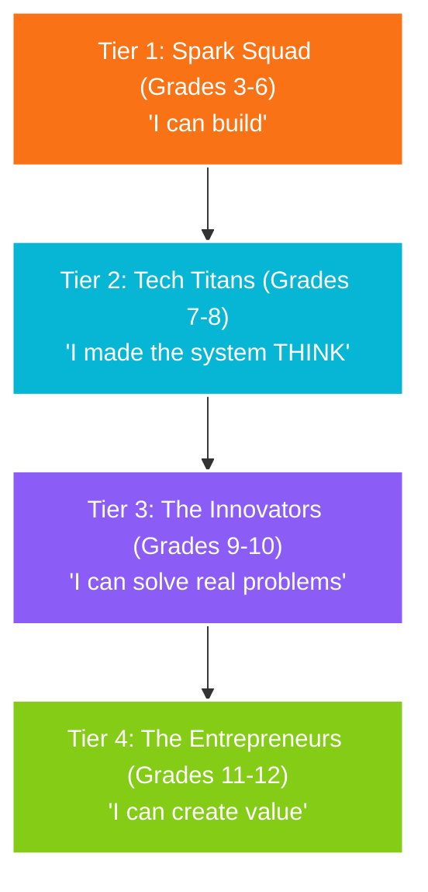

# LearnSMTH: Brand Concept, Strategy & Asset Analysis

LearnSMTH is a sophisticated, research-backed **identity-driven experiential STEM and innovation ecosystem** designed for K–12 children, with an initial pilot targeting Grades 3–6 (the Spark Squad). Unlike generic coding camps or robotics workshops, LearnSMTH focuses on building children's **confidence, curiosity, and collaboration** by guiding them to build real-world physical systems, document their creation journey, and present their work to their parents and communities.

---

## 1. Core Pedagogical & Business Concept

### A. The Educational Philosophy
LearnSMTH is built on the pedagogical principle that children learn best when they are emotionally engaged, solve relatable problems, and work with their hands. It integrates **Design Thinking Integrated Learning (DTIL)** across science, math, engineering, and computer science.

Instead of rote learning, the curriculum follows a **8-stage design process**:
1. **Empathize**: Understand real-world impact and human needs.
2. **Explore**: Investigate contexts and observe systems.
3. **Define**: Clarify the specific problem and constraints.
4. **Ideate**: Brainstorm possible solutions.
5. **Prototype**: Build physical or digital representations of ideas (starting with breadboards).
6. **Test**: Debug and refine.
7. **Evaluate**: Assess if goals are met.
8. **Optimize**: Iterate to improve the design.

### B. The 4-Tier Identity-Driven Progression
LearnSMTH gamifies the STEM learning journey by assigning psychological personas (avatars) that evolve with the student's age:

| Tier | Grade | Name | Psychological Shift | Key Technology Vibe |
| :--- | :--- | :--- | :--- | :--- |
| **Tier 1** | 3–6 | **Spark Squad** | *"I can build"* | Basic electronics, story-driven missions, low-voltage breadboards |
| **Tier 2** | 7–8 | **Tech Titans** | *"I made the system THINK"* | Arduino, logic gates, automation, coding logic, sensors |
| **Tier 3** | 9–10 | **The Innovators / Visionaries** | *"I can solve real problems"* | Open-ended systems, AI, sustainability, data science, UX design |
| **Tier 4** | 11–12 | **The Entrepreneurs / Industry Mentors** | *"I can create value"* | Venture design, startup creation, pitching, commercial viability |

### C. Scientific Validation (The Learning Science Moat)
LearnSMTH positions itself as a premium option for academic-minded parents by grounding its curriculum in research from top universities:
* **Indiana University (Karin H. James)**: Cognitive neuroscience showing that self-generated motor actions (like building a PCB) reshape brain perception systems, enhancing symbol recognition, reading, and mathematics.
* **Harvard Center on the Developing Child**: Research on *Brain Architecture* showing that early experiences and hands-on interactions shape the physical structures of the brain for lifelong learning.
* **Stanford University**: Neuroscience initiative proving that middle school students learn better when engaging in guided, real science experiences.
* **MIT Media Lab**: Constructionist theory pioneered by Seymour Papert, asserting that learning is most effective when children build physical artifacts.

### D. The Commercial Model & Delivery Engine
LearnSMTH solves a critical parent pain point: **convenience and visible outcomes**.
* **Zero-Hassle Delivery**: Operates directly in residential/apartment community clubhouses (OMR, Velachery, Pallavaram in Chennai). Parents save commute times, and children learn in a safe environment.
* **Visible Outcomes**: Children walk home holding a working, permanent physical product (a custom printed circuit board, or PCB) that they built and debugged themselves.
* **Public-Speaking Video Portfolio**: Mentors record children presenting their final builds, showing parents tangible gains in communication confidence.
* **The Telemetry Moat (ILQ™)**: Uses a proprietary **Individual Learning Quotient (ILQ™)** tracking three pillars: *Individual Capability*, *Identity/Avatar Synergy*, and *Collaborative Quotient*. Telemetry feeds into a digital app where parents monitor step-by-step progress, driving a zero-CAC viral referral loop.

---

## 2. Main Folder HTML File Comparison: `index.html` vs. `index_v2.html`

The project has two landing pages representing different stages of design fidelity:

### `index.html` (The Premium Design System)
* **Design & Theme**: Sleek dark-mode theme utilizing a premium palette (cyan/teal accents, deep navy backgrounds, warm orange buttons, and purple Highlights). Uses CSS variables (`:root`) for design tokens.
* **Rich Layout**: Implements glassmorphism, responsive grid layouts, card hover-effects, custom rounded corners, and smooth transitions.
* **Sections Included**:
  * Navigation header with sticky tracking.
  * Hero banner with a 4-tier pipeline overview and call-to-action (CTA).
  * 4-tier learning pipeline grid (Discover, Design, Build, Share).
  * Avatar showcase featuring "Tech Titans" and "Visionaries".
  * Immersive "Mission Showcase" cards (Flood Alert & Smart Greenhouse).
  * Integration with the **SRM Vadapalani Incubation Pitch** (`SRMPitch.html`).
  * Structured "Inside a Real Mission" step-by-step list.
  * Detailed "Backed by Science" university grid featuring Harvard, Stanford, Indiana, and MIT.
  * Interactive, responsive waitlist form that exports data into a downloadable JSON file for CRM logging.
  * Footer specific to Chennai apartment communities.

### `index_v2.html` (The Basic Skeleton)
* **Design & Theme**: A light-themed, minimal framework using standard Arial/serif fonts, generic blue headers, and simple grey section divs.
* **Low-Fidelity Structure**: Lacks custom variables, glassmorphism, or modern CSS layout wrappers. Displays placeholder border outlines (`ph` class) for images.
* **Differences**: Acts as a bare-bones schematic page. While it contains similar textual blocks (mission days, catalog outline, TUITION alternative), it lacks the rich visual storytelling, branding, and cohesive structure implemented in the primary `index.html`.

---

## 3. Analysis of Folder Assets

### A. Main Folder Assets
* [index.html](file:///c:/Users/Public/Projects/2nd%20Innings/goLearnSomething/index.html): The primary, high-fidelity responsive marketing website targeted at Chennai parents.
* [index_v2.html](file:///c:/Users/Public/Projects/2nd%20Innings/goLearnSomething/index_v2.html): The low-fidelity wireframe version.
* [SRMPitch.html](file:///c:/Users/Public/Projects/2nd%20Innings/goLearnSomething/SRMPitch.html): A gorgeous, 1280x720 slide-based presentation built directly in HTML. It pitches the business incubator at SRM Vadapalani. The pitch centers on a **SpaceX Starship inspired lesson module** to illustrate how a news clip of a rocket launch translates into measurement labs, chemical combustion theory, Newton's third law physics, collaborative payloads, and final PCB assembly.
* [SRMPitch.pdf](file:///c:/Users/Public/Projects/2nd%20Innings/goLearnSomething/SRMPitch.pdf): The PDF print representation of the SRM incubation pitch.

### B. Docs Folder Assets (Strategic & Curricular Foundations)
The `docs` folder contains the academic, commercial, and operational core of the project:

| File Name | Format | Primary Strategic Purpose |
| :--- | :--- | :--- |
| **LearnSMTH_Project_Proposal_V2.pdf / .docx** | PDF / DOCX | **The Growth Blueprint**: Details the corporate vision, DTIL framework, ILQ™ metrics, technology stack (React, Java Spring Boot, Kafka, MongoDB), and the Chennai pricing models. |
| **Design Thinking Integrated Learning - K12 Curriculum.pdf / .docx** | PDF / DOCX | **The Pedagogical Foundation**: Outlines how design thinking is integrated into standard STEM fields, curriculum constraints, and assessment models. |
| **THE TECH TITANS grades 7-8.pdf** | PDF | **Tier 2 Focus**: Details the psychological jump from "building" (Tier 1) to "automation/system logic" (Tier 2). Maps the personas of Ryan (Architect), Isha (Coder), Kabir (Maker), Tara (Designer), Zain (Analyst), and Mentor AI-X. |
| **Communications.md** | Markdown | **Credibility Engine Copy**: Social media templates, poster taglines, and a week-by-week credibility theme tracker linking Harvard serve-and-return concepts directly to Chennai apartment marketing. |
| **Notes on the evaluation.txt** | Plain Text | **Operational Mechanics**: Explains the difference between in-person workshops (stealth rubrics by Mentor K on a tablet) and subscription digital telemetry (event-driven Kafka streams tracking student reading/clicking habits). |
| **Proposal to SRM Vadapalani Incubation Center v1.pdf / .docx** | PDF / DOCX | **Incubation Request**: Business application detailing how LearnSMTH uses SRM mentorship, maker labs, and engineering student volunteers to validate localized pilots. |
| **Tier 3 & Tier 4 Outlines** | DOCX | Character bibles, mission setups, and curriculum focus areas for High School students (Grades 9-12). |

### C. Images Folder Assets (Visual Design System)
The images folder contains rich visual assets categorized into four groups:

#### 1. Identity & Character Avatars
* **Tier 1 (Grades 3-6)**: `Tier1 SparkSquad Avatars.jpeg` / `image_47f006.jpeg` introduces characters (Aarav the Builder, Meera the Thinker, Vihaan the Explorer, Diya the Creator, Mentor K).
* **Tier 2 (Grades 7-8)**: `TechTitans Avatar V2.png` and `Techtitans Avatar.png` (representing the same characters at an older age, mapping to System Thinker roles).
* **Tier 3 (Grades 9-10)**: `The Innovators Grade 9-10 avatars.png` (characters as advanced system designers).
* **Tier 4 (Grades 11-12)**: `The founders - Tier 4 Grade 11-12 Avatars.png` (characters adopting business founder and strategist roles).

#### 2. Mission Poster Graphics
* `Tech Titans Mission Flood alert system.png`: Inspired by Chennai's monsoon struggles, illustrating the water sensor alert challenge.
* `Tech Titans Mission Smart Green house.png` / `The innovatiors mission Green House.png`: Focuses on automatic irrigation, Light, and Temperature sensors.
* `Tech Titans The Cooling Dome Challenge.png`: A high-heat dome survivability mission.
* `spy-mission.jpg`, `space-mission.jpg`, `eco-mission.jpg`, `health-mission.jpg`, `games-mission.jpg`, `city-mission.jpg`: Modular icons for the mission selector grid on the web.

#### 3. Real-World Build & Marketing Assets
* `Kidsincommunityhallwithparents.png` / `hero-community.png`: High-impact photos showing parents and kids building together in clubhouses, reinforcing the community vibe.
* `KidsworkingonthePCB.png`: Showcases collaborative engineering.
* `studentstogoKit.png`: A mother recording her children with their completed kits.
* `Jr electronic kit overall`, `Garde 2-4 kit output`, `Grade 2-4 kit overall`, `Jr electronics overview`: Direct product photography showing the physical breadboards, soil sensors, switches, LEDs, and wires.
* `Credibility sample.png`: Infographics illustrating neuroscience and learning-by-doing frameworks.
* `harvard-logo.png`, `stanford-logo.png`, `indiana-logo.png`, `mit-logo.png`: Logos of target research institutions.

#### 4. Video Ads
* `Promo English.mpeg` and `Promo Tamil.mpeg`: Short video ads designed for WhatsApp and Instagram outreach targeting parents in Chennai's IT residential developments.

---

### Conclusion of Understanding
LearnSMTH is a highly structured, premium educational product. By combining the **neurological benefits of hands-on building** with **gamified character avatars** and **residential convenience**, it establishes a robust value proposition for parents. 

The entry point website `index.html` leverages these high-fidelity visual assets and academic validations to build immediate trust, while the strategic documents in `docs` prepare the company for technology scaling (Kafka, Java, MongoDB, AI telemetry) and local incubation (SRM Vadapalani).
